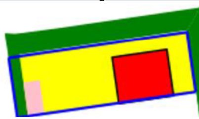
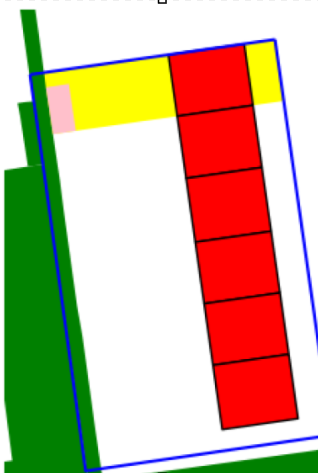
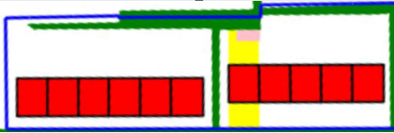
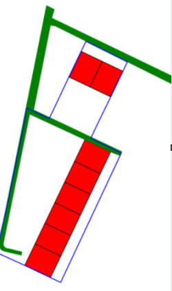
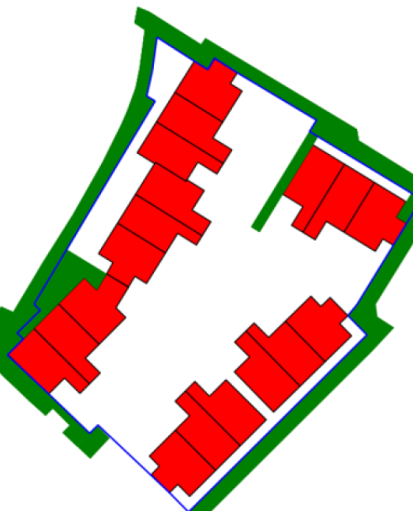

# Tuinoppervlakte berekenen op basis van BAG, BGT en Kadaster

Dit project berekent per woning de buitenruimte en berging op basis van openbare data. Eerst koppelen we woningen aan een perceel, daarna passen we een speicifeke  geometrische methode toe om het perceel van de woning te bepalen. Vanuit dat deelperceel bereken we de tuinoppervlakte.

De aanpak is praktisch en werkt voor een groot deel van de woningen. Deze methode werkt niet voor flats aangezien of etagewoningen aangezien we niet weten welke woning op de beganegrond staat. In het algemeen trekken we vanuit relevante woningmuren lijnen door tot aan perceelgrenzen of openbare ruimte, zodat een logisch perceeldeel per woning ontstaat. De methode is niet perfect in alle uitzonderingssituaties, maar levert voor ongeveer 80% van het bezit een betrouwbaar resultaat.

## Benodigde data

Voor een run zijn drie bronbestanden nodig:

1. BGT via https://app.pdok.nl/lv/bgt/download-viewer/
2. BAG via https://service.pdok.nl/lv/bag/atom/bag.xml
3. Kadaster via https://app.pdok.nl/kadaster/kadastralekaart/download-viewer/

Plaats de bestanden in de bijbehorende mappen:

1. BGT in data/bgt (minimaal bgt_wegdeel.gml en bgt_pand.gml)
2. BAG in data/bag
3. Kadaster in data/kad

Daarnaast is een lijst met woningen nodig in data/bag_ids:

1. Bestandsnaam bag_ids.xlsx of bag_ids.csv
2. Verplichte kolom Pand Id

## Workflow

Het script bestaat uit twee hoofdstappen:

1. Woningen koppelen aan perceelnummers
2. Tuin- en bergingoppervlakte berekenen per woning

Als er al perceelkoppelingen aanwezig zijn, wordt de matchstap overgeslagen. Anders worden de koppelingen eerst bepaald op basis van de kadastrale lijnen en BAG-geometrie.

Daarna verwerkt het script alleen woningen met een uniek Pand Id en een bekend perceelnummer. Per perceel wordt de perceelpolygoon opgebouwd en geclassificeerd, waarna de juiste aanpak wordt gekozen.

## Beslisboom in de berekening

De code onderscheidt drie hoofdtypen percelen:

1. Single: 1 woning op een perceel
2. Multiple aligned: 1 rij woningen op een perceel
3. Open: meerdere rijen of geen rijen op een perceel

Per type wordt een andere geometrische strategie toegepast.

### Single

Bij het single type wordt het perceel direct gekoppeld aan de woning. Daarna worden wegdelen, woningoppervlak en eventuele berging in mindering gebracht om de tuinoppervlakte te bepalen.

### Multiple aligned

Bij woningen in één rij wordt gewerkt met gedeelde muren tussen buren om grenzen tussen woningdelen af te leiden.

Er zijn twee veelvoorkomende varianten:

1. Rijen met twee hoekwoningen

2. Rijen met meer dan twee hoekwoningen of complexere hoekgeometrie

### Open

In open configuraties worden grenslijnen afgeleid vanuit gedeelde wanden en doorgetrokken richting weg of perceelrand. Zo ontstaat een bruikbare perceelverdeling voor woningen die niet netjes in één lijn staan.

In het geval van een open perceel zonder weg of andere scheidingslijnen kunnen we het tuin oppervlakte niet berekenen.

## Handmatige correctie

Voor lastige of fout geclassificeerde tuinen kan je met het manuel script handmatig de tuingrenzen aangeven.

## Script uitvoeren

Gebruik de automatische run voor de standaardverwerking. De handmatige run gebruik je voor uitzonderingen of validatie van moeilijke cases.

In beide gevallen blijft de kern hetzelfde:

## Bekende verbeterpunten

1. Open: betere validatie of een afgeleid perceelpolygoon echt geldig is
2. Multiple aligned: betere afhandeling van binnenhoeken en woningen met afwijkende vormen